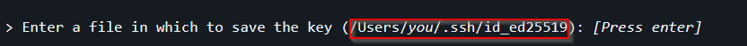
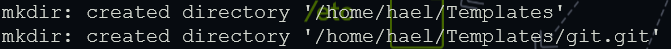
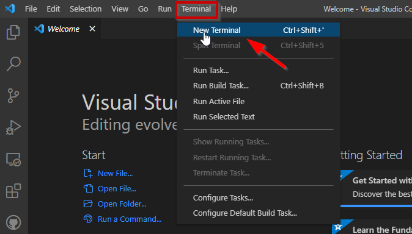
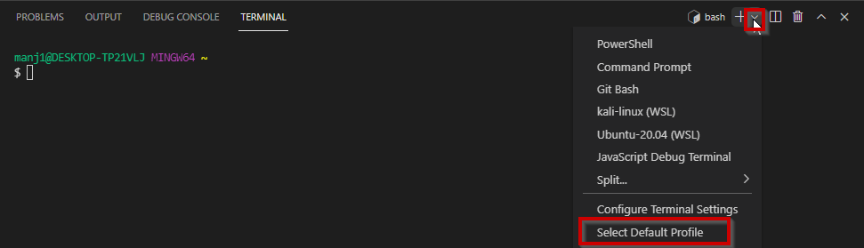
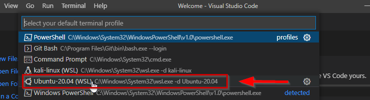
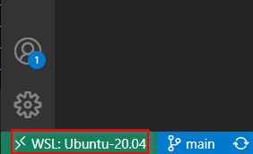
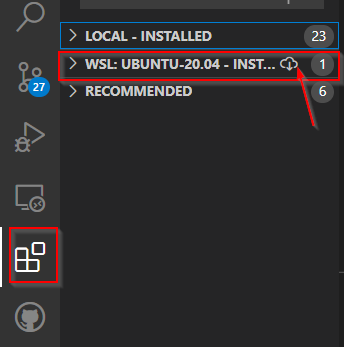
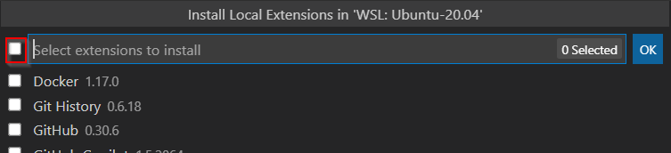
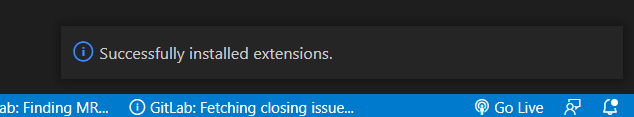

# Black Codher setup guide

This guide is to help you setup the following required software during the Black Codher bootcamp.

1. [Windows Terminal](#windows-terminal) **THIS IS FOR WINDOWS USERS ONLY**
1. [Setup Home Path Alias](#setup-home-path-alias-in-windows-terminal) **THIS IS FOR WINDOWS USERS ONLY**
1. [Git](#git)
   - [Setup SSH Keys for GitHub](#setup-ssh-keys-for-github)
   - [Configure Default Branch for Git Init](#configure-default-branch-for-git-init)
1. [Node](#node)
1. [Visual Studio Code](#visual-studio-code)
   - [Extensions](#extensions)
1. [Configuring a Default Terminal in VS Code](#configuring-a-default-terminal-in-vs-code) **THIS IS FOR WINDOWS USERS ONLY**
1. [Setting Up VS Code Extensions For WSL Environment](#setting-up-vs-code-extensions-for-wsl-environment) **THIS IS FOR WINDOWS USERS ONLY**
1. [Slack](#slack)
1. [Google Chrome](#google-chrome)
   - [Extensions](#chrome-extensions)

**If you haven't already created a [GitHub](https://github.com/signup?ref_cta=Sign+up&ref_loc=header+logged+out&ref_page=%2F&source=header-home) account, now is the time to do it.**

---

## Windows Terminal

The Windows Terminal is a modern, fast, efficient, powerful, and productive terminal application. You will be using it to write commands to install software for your projects and run commands to power the applications you will be creating.

**Watch the Guide on [YouTube](https://www.youtube.com/watch?v=wPmwgMm0plk)**

### How to install Windows Terminal

Please follow the instructions that are appropriate for your version of Windows.

#### Windows 10
[Click on this link](https://www.microsoft.com/en-gb/p/windows-terminal/9n0dx20hk701?activetab=pivot:overviewtab). Once you are on the page click **Get**, then click Install.
                                                                                              
Alternatively, open up the Microsoft Store and search for *Windows Terminal*. Proceed to install this app.

Once the installation is finished you will need to to create a Windows Subsystem for Linux. Below are the steps to follow. Optionally you can view the more detailed [steps here](https://docs.microsoft.com/en-us/windows/wsl/install-win10#step-2---check-requirements-for-running-wsl-2) .

- Install Windows Subsystem for Linux on Windows 10:
   -  Enable WSL:
      - Open up Windows Powershell as an Administrator(right-click the start menu and select 'Windows Powershell(Admin)'
      - Paste the following command and run

         ```
         dism.exe /online /enable-feature /featurename:Microsoft-Windows-Subsystem-Linux /all /norestart
         ```

   - Enable 'Virtual Machine Platform':
      - Open up Windows Powershell as an Administrator(right-click the start menu and select 'Windows Powershell(Admin)'
      - Paste the following command and run
      
        ```
        dism.exe /online /enable-feature /featurename:VirtualMachinePlatform /all /norestart
        ```
        
      - Restart your computer to complete the installation.
   - Check if your computer is compatible with WSL2 [here](https://docs.microsoft.com/en-us/windows/wsl/install-win10#step-2---check-requirements-for-running-wsl-2). Skip downloading and setting wsl2 as default(the next two steps) if it is not compatible, WSL1 will be used instead. 
   - Download the Linux Kernel Update Package [here](https://wslstorestorage.blob.core.windows.net/wslblob/wsl_update_x64.msi). Double-click to run. Select yes when prompted for admin permissions.
   - Set WSL2 as default
      - Open up Windows Powershell as an Administrator(right-click the start menu and select *'Windows Powershell(Admin)'*
      - Paste the following command and run 
      
        ```
        wsl --set-default-version 2
        ```
        
   - Install a Linux distribution:
      - Install Ubuntu 20.04 LTS from the Microsoft store. You can search for it or use this link [here](https://www.microsoft.com/store/productId/9N6SVWS3RX71)
      - Launch it from from the start menu. Tip: search `Ubuntu` in the start menu.
      - You will be prompted to set a user account and password for the distribution.
      - Once the setup has been complete, run `sudo apt update && sudo apt upgrade` to update the environment.If prompted for any input, type in *y* and hit enter.
      - Once it has finished running, close the window.
- Configure Windows Terminal to run Ubuntu by default:
   - Open up Windows Termnial
   - Click on the down arrow the top bar; click on settings
   - In the Startup view, click the 'Default Profile' drop-down and select *Ubuntu-20.04*
   - Click Save at the bottom right of the window and restart your terminal

#### Windows 8

If you are currently using Windows 8, we recommend you upgrade to Windows 10. To upgrade you must have the following minimum system requirements:

- Latest OS: Make sure you're running the latest version—either Windows 7 SP1 or Windows 8.1 Update.
- Processor: 1 gigahertz (GHz) or faster processor or SoC.
- RAM: 1 gigabyte (GB) for 32-bit or 2 GB for 64-bit.
- Hard disk space: 16 GB for 32-bit OS or 20 GB for 64-bit OS.

To download and install Windows 10, [click here](https://www.microsoft.com/eb-gb/software-download/windows10) and follow the installer instructions.

If you are unable to upgrade to Windows 10 [email us](mailto:tech@blackcodher.com?subject=Windows%208%20upgrade%20issues) straight away and do not proceed with the rest of this guide.

---

## Setup Home Path Alias in Windows Terminal

**Prerequisite**: Ensure that before attempting this tasks, you have setup [Windows Terminal](#windows-terminal)

- Open up windows Terminal
- Run `pwd` and take note of the output
- Run `echo "alias home='cd <mount directory path>'" >> ~/.bash_aliases where <mount directory path>`, replacing `<mount directory path>` with the output you received from running `pwd`.
- Run `source ~/.bashrc`

---

## Git

Git is a version control system and will let you:

- Manage your code changes
- Revert to older copies

### Windows installation

The instructions below mention **Git Bash** and **Windows command prompt**, you shouldn't use either of these and use the [windows terminal](#windows-terminal) you installed above to install git.

[Follow the instructions](https://github.com/git-guides/install-git#install-git-on-windows).

**Setup Git Credential Manager Core (Windows Users Only)**

*Note: Proceed with this step only after installing Git*

Git Credential Manager (GCM) Core enables you to authenticate a remote Git server, even if you have a complex authentication pattern like two-factor authentication, or using SSH remote URLs that require an SSH key password for every Git push.

- Open up Windows Terminal
- Enter this command and run: `git config --global credential.helper "/mnt/c/Program\ Files/Git/mingw64/libexec/git-core/git-credential-manager-core.exe"`

### Mac installation

[Follow the instructions](https://github.com/git-guides/install-git#install-git-on-mac).

---

## Setup SSH Keys for GitHub

- Open Terminal

- Run the following code, substituting in your GitHub email address in the last placeholder: `ssh-keygen -t ed25519 -C "your_github_email@email.com"`

- When you're prompted to "Enter a file in which to save the key," press Enter to save the file in the default location. Note the default location as shown in the image below:


- When prompted, type a secure passphrase. Note down the passphrase for use later.

- Once that is successful, run `cat /Users/you/.ssh/id_ed25519.pub`. Replace `/Users/you/.ssh/id_ed25519` with the default location shown earlier in step 3. Take note of the output.

- Navigate to your GitHub profile and go to settings. Click on the Tab named "SSH and GPG keys"> Click 'New SSH Key'

- In the box labelled Key, input the output you got from step 5 and then input a title. This could be just the device you are working on .e.g 'My Silver Mac'.

- Finally, click 'Add SSH Key'

### Configure Default Branch for Git Init

- Verify your version of Git by running `git --version`
If your version number is below 2.28, then proceed with the steps below. Otherwise, skip to the steps under Version 2.28.

#### Below Version 2.28
- Open the Terminal
- Download the configure script by running: `wget https://raw.githubusercontent.com/blackcodherbootcamp/setup-guide/main/script.sh`
- Then run `./script.sh`
- You should receive the following output or something similar:


#### Version 2.28 and above
- Run `git config --global init.defaultBranch main`
- Close the Terminal.

## Node

You will need to install Node not only for the NodeJS unit, but also for React. By installing Node you can use its a [package manager](https://en.wikipedia.org/wiki/Package_manager) (Node Package Manager or `npm`) to install other software that you will use in your projects later in the course.

### How to install node

[Click on this link](https://nodejs.org/en/download/) and choose the installer appropriate for your computer (mac). Follow the instructions the installer gives.

#### How to Install Node in WSL (Windows Users Only)

**Prerequisite**: Before performing the steps listed below, you should have completed the setup on [Windows Terminal](#windows-terminal).

- Open up Windows Terminal from the start menu
- Install Node Version Manager(nvm) by running: `curl -o- https://raw.githubusercontent.com/nvm-sh/nvm/v0.38.0/install.sh | bash`
- Close the current terminal and reopen it.
- Verify that the installation was successful by running: `nvm --version`. It should display a version number. If you receive 'command not found' or no response at all, restart the terminal and rerun the installation.
- Install the latest stable LTS release of Node.js by running: `nvm install --lts`
- Afterwards, verify the Node and Node package manager(npm) installation by running: `node --version` and `npm --version` respectively. Both commands should display decimal numbers e.g. `v14.18.0` or `6.14.15`

---

## Visual Studio Code

Visual Studio Code (VS code) is a source code editor made by Microsoft. It will enable you to write code and can identify errors in the code, and make suggestions.

You will use it to write all your code.

### How to install VS Code

[Click on this link](https://code.visualstudio.com/download) and choose the installer appropriate for your computer (windows or mac). Follow the instructions the installer gives.

**For Windows Users**: When prompted to Select Additional Tasks during installation, be sure to check the *Add to PATH* option so you can easily open a folder in WSL using the code command.

### Extensions

There are many extensions in VS Code to can improve your productivity, add some fun into your workspace, and generally aid how you work. Below are some of the key extensions that will help during the course and beyond. If you find other useful extensions don't forget to share with everyone.

[You can install all extensions directly from inside VS Code](https://code.visualstudio.com/docs/editor/extension-marketplace#_browse-for-extensions).

#### [Prettier](https://marketplace.visualstudio.com/items?itemName=esbenp.prettier-vscode)

Prettier is an opinionated code formatter. It enforces a consistent style by parsing your code and re-printing it with its own rules that take the maximum line length into account, wrapping code when necessary. In plain English it formats your code to make it consistent, easy to read and well...pretty.

Once prettier has been installed there is some extra configuration to do. [This video](https://www.youtube.com/watch?v=zd_aDbwr4pY) will guide you on how to make prettier format your code eveytime you save a file.

#### [Remote Development](https://marketplace.visualstudio.com/items?itemName=ms-vscode-remote.vscode-remote-extensionpack)

The Remote Development extension pack allows you to open any folder in a container, on a remote machine, or in the Windows Subsystem for Linux (WSL) and take advantage of VS Code's full feature set.

#### [Live Server](https://marketplace.visualstudio.com/items?itemName=ritwickdey.LiveServer)

Launches a development local Server with live reload feature for static & dynamic pages. This will be useful during the JavaScript unit.

#### [Live Share](https://marketplace.visualstudio.com/items?itemName=MS-vsliveshare.vsliveshare)

Visual Studio Live Share enables you to collaboratively edit and debug with others in real time.

#### [Bracket Pair Colorizer 2](https://marketplace.visualstudio.com/items?itemName=CoenraadS.bracket-pair-colorizer-2)

This extension allows matching brackets to be identified with colours.

#### [Auto Rename Tag](https://marketplace.visualstudio.com/items?itemName=formulahendry.auto-rename-tag)

Automatically renames paired HTML tags.

---

### Configuring a Default Terminal in VS Code

To make sure the terminal available directly inside VS Code is the terminal you installed and configured in the [windows terminal step](#windows-terminal), you will need to complete the following steps:

- Open Visual Studio Code
- Click on the Tab labelled *Terminal* at the top of the VS code window
- Click on *New Terminal*. This should open up a pane at the bottom part of VS code.

 

- In the bottom window, click the drop-down arrow right beside the plus sign
- Click *Select Default Profile*. A dialog box displays at the top bar.



- Select the option that says *Ubuntu-20.04*



- Finally restart VS code

---

### Setting Up VS Code Extensions For WSL Environment

**Note**: This step should only be done afte the inital setup of VS Code and installing of the extensions listed above.

- Open the Windows Terminal from the Start Menu
- Type `code .` in the terminal and hit Enter to run. When doing this for the first time, you should see VS Code fetching components needed to run in WSL. This should only take a short while, and is only needed once.
- After a moment, a new VS Code window will appear, and you'll see a notification that VS Code is opening the folder in WSL. VS Code will now continue to configure itself in WSL and keep you up to date as it makes progress.
- Once finished, you now see a WSL indicator in the bottom left corner. 

- Click on the Extensions Tab on the side bar in the VS Code.
- Locate the categroy labelled `WSL: UBUNTU-20.04 - INSTALLED` and click the cloud icon that appears on it as shown below:

  
- In the popup that appear, tick the first box at the top and then click OK.

- The extensions are being installed. Once successful, a pop up box will appear at the bottom right of the VS code window as shown below:


---

## Slack

Slack is a chat and collaboration tool. You will use it to:

- Keep in touch with each other
- Ask questions
- Contact mentors, instructors and teaching assistants
- Build a community

### How to install Slack

[Windows](https://slack.com/intl/en-gb/help/articles/209038037-Download-Slack-for-Windows) - follow the instructions.

[Mac](https://slack.com/intl/en-gb/help/articles/207677868-Download-Slack-for-Mac) - follow the instructions.

---

## Google Chrome

The developer tools available in Google Chrome helps with all different scenarios that you will get into during the bootcamp. This is our browser of choice for the bootcamp.

### How to install Chrome

[Click on this link](https://support.google.com/chrome/answer/95346?hl=en-GB&co=GENIE.Platform%3DDesktop) and choose the installer appropriate for your computer (windows or mac). Follow the instructions the installer gives.

### Chrome Extensions

Below we have listed some Chrome extensions that will enhance make your development experience. If you find other useful extensions don't forget to share with everyone.

#### [React Developer Tools](https://chrome.google.com/webstore/detail/react-developer-tools/fmkadmapgofadopljbjfkapdkoienihi)

Adds React debugging tools to the Chrome Developer Tools.

#### [Debug CSS](https://chrome.google.com/webstore/detail/debug-css/igiofjnckcagmjgdoaakafngegecjnkj)

Adds an outline to all elements on the page to show the culprit element which is changing desired layout.
