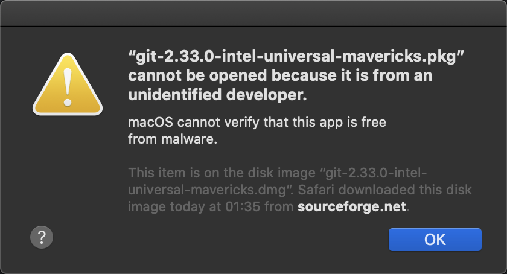

# Mac setup guide

This guide is to help you setup the following required software during the Black Codher bootcamp for Mac OS. Read the instructions for each application *in full* before proceeding to commence installation. 

Many of the steps will require you to use a command-line interface (also referred to as a _CLI_, _terminal_ or _shell_), which you may not be familiar with. Please note the following:

- You can't use a mouse or trackpad inside a terminal, except to scroll and execute clipboard operations like selecting, copying and pasting text. The text cursor can only be controlled using the arrow keys on your keyboard.
- Where passwords must be entered, you won't see the text you're typing displayed onscreen, but your keystrokes will be input as nornal. This is expected behaviour, so be careful when entering secure text and if you think you've made a mistake, hit the backspace key until an audible alert lets you know that you've cleared all the input.
- Where a command is provided, you will run it by typing or pasting it in and then hitting Return/Enter on your keyboard.
- When a given command contains text in angle brackets, e.g. `echo "alias home='cd <mount directory path>'" >> ~/.bash_aliases`, this represents a placeholder that you **must** replace with the correct value for your environment. Instructions will be provided to tell you what the placeholder should be replaced with.

## Table of Contents

1. [Git](#git)
   - [Setup SSH Keys for GitHub](#setup-ssh-keys-for-github)
   - [Configure Default Branch for Git Init](#configure-default-branch-for-git-init)
1. [Node](#node)
1. [Visual Studio Code](#visual-studio-code)
   - [Extensions](#extensions)
1. [Discord](#discord)
1. [Google Chrome](#google-chrome)
   - [Extensions](#chrome-extensions)

**If you haven't already created a [GitHub](https://github.com/signup) account, now is the time to do it.**

**IMPORTANT**

When downloading and installing applications from the internet, macOS may block their execution with a message like this:

To get around this, right-click the file you're trying to run and select "Open". When a second dialog is displayed asking if you're sure you want to open the file, click "Open". After this, double-clicking the file should open it as usual. See the [macOS support article](https://support.apple.com/en-gb/guide/mac-help/mh40616/mac) for more details.

---

## Git

Git is a version control system and will let you:

- Manage your code changes
- Revert to older copies

[Follow these installation instructions](https://github.com/git-guides/install-git#install-git-on-mac).

---

### Setup SSH Keys for GitHub

1. Open Terminal

1. Run the following code, substituting in your GitHub email address in the last placeholder: `ssh-keygen -t ed25519 -C "your_github_email@email.com"`

1. When you're prompted to "Enter a file in which to save the key," press Enter to save the file in the default location. Note the default location as shown in the image below:

1. When prompted, type a secure passphrase. Note down the passphrase for use later.

1. Add your key to the `ssh-agent` by following [Steps 1-3](https://docs.github.com/en/authentication/connecting-to-github-with-ssh/generating-a-new-ssh-key-and-adding-it-to-the-ssh-agent#adding-your-ssh-key-to-the-ssh-agent)

### Add SSH Key to GitHub

[Follow these installation instructions](https://docs.github.com/en/authentication/connecting-to-github-with-ssh/adding-a-new-ssh-key-to-your-github-account) or the following steps:

1. Run `pbcopy < <defaultLocation>.pub`, which will copy the public key to your clipboard. If `pbcopy` doesn't work, execute `cat <defaultLocation>.pub` and copy the output manually, ensuring you don't capture any extra whitespace or linebreaks at the end of the text. Whichever command you use, replace `<defaultLocation>` with the default location shown earlier in step 3.

1. Navigate to your GitHub profile and go to settings. Click on the Tab named "SSH and GPG keys"> Click 'New SSH Key'

1. In the box labelled Key, paste the output you copied from step 6 and then input a title. This could be just the device you are working on .e.g 'My Silver Mac'.

1. Finally, click 'Add SSH Key'

### Configure Default Branch for Git Init

- Verify your version of Git by running `git --version`
If your version number is below 2.28, then proceed with the steps below. Otherwise, skip to the steps under Version 2.28.

#### Below Version 2.28

- Navigate to the [Git installer downloads page](https://sourceforge.net/projects/git-osx-installer/files/) and download the latest version (first item in the list)
- Open the downloaded archive
- Double-click the package icon to run the installer
- Click "Continue", then "Install". Once installation is completed, click "OK".
- You may confirm the updated version is installed by running `git --version`, then continue with the instructions below.

#### Version 2.28 and above

- Run `git config --global init.defaultBranch main`
- Close the Terminal.

## Node

You will need to install Node not only for the NodeJS unit, but also for React. By installing Node you can use its a [package manager](https://en.wikipedia.org/wiki/Package_manager) (Node Package Manager or `npm`) to install other software that you will use in your projects later in the course.

### How to install node

[Click on this link](https://nodejs.org/en/download/), choose the mac installer and follow the instructions the it gives.

---

## Visual Studio Code

Visual Studio Code (VS code) is a source code editor made by Microsoft. It will enable you to write code and can identify errors in the code, and make suggestions.

You will use it to write all your code.

### How to install VS Code

[Click on this link](https://code.visualstudio.com/download), choose the mac installer and follow the instructions the it gives.

### Extensions

There are many extensions in VS Code to can improve your productivity, add some fun into your workspace, and generally aid how you work. Below are some of the key extensions that will help during the course and beyond. If you find other useful extensions don't forget to share with everyone.

[You can install all extensions directly from inside VS Code](https://code.visualstudio.com/docs/editor/extension-marketplace#_browse-for-extensions).

#### [Prettier](https://marketplace.visualstudio.com/items?itemName=esbenp.prettier-vscode)

Prettier is an opinionated code formatter. It enforces a consistent style by parsing your code and re-printing it with its own rules that take the maximum line length into account, wrapping code when necessary. In plain English it formats your code to make it consistent, easy to read and well...pretty.

Once prettier has been installed there is some extra configuration to do. [This video](https://www.youtube.com/watch?v=zd_aDbwr4pY) will guide you on how to make prettier format your code eveytime you save a file.

#### [Live Server](https://marketplace.visualstudio.com/items?itemName=ritwickdey.LiveServer)

Launches a development local Server with live reload feature for static & dynamic pages. This will be useful during the JavaScript unit.

#### [Live Share](https://marketplace.visualstudio.com/items?itemName=MS-vsliveshare.vsliveshare)

Visual Studio Live Share enables you to collaboratively edit and debug with others in real time.

#### [Bracket Pair Colorizer 2](https://marketplace.visualstudio.com/items?itemName=CoenraadS.bracket-pair-colorizer-2)

This extension allows matching brackets to be identified with colours.

#### [Auto Rename Tag](https://marketplace.visualstudio.com/items?itemName=formulahendry.auto-rename-tag)

Automatically renames paired HTML tags.

---

## Discord

Discord is a chat and collaboration tool. You will use it to:

- Keep in touch with each other
- Ask questions
- Contact mentors, instructors and teaching assistants
- Build a community

### How to install Discord

[Follow these instructions](https://discord.com/download)

---

## Google Chrome

The developer tools available in Google Chrome helps with all different scenarios that you will get into during the bootcamp. This is our browser of choice for the bootcamp.

### How to install Chrome

[Click on this link](https://support.google.com/chrome/answer/95346?hl=en-GB&co=GENIE.Platform%3DDesktop), choose the mac installer and follow the instructions the it gives.

### Chrome Extensions

Below we have listed some Chrome extensions that will enhance make your development experience. If you find other useful extensions don't forget to share with everyone.

#### [React Developer Tools](https://chrome.google.com/webstore/detail/react-developer-tools/fmkadmapgofadopljbjfkapdkoienihi)

Adds React debugging tools to the Chrome Developer Tools.

#### [Debug CSS](https://chrome.google.com/webstore/detail/debug-css/igiofjnckcagmjgdoaakafngegecjnkj)

Adds an outline to all elements on the page to show the culprit element which is changing desired layout.
