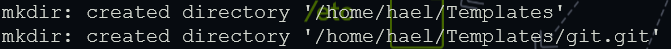

# Mac setup guide

This guide is to help you setup the following required software during the Black Codher bootcamp for Mac OS.

1. [Git](#git)
   - [Setup SSH Keys for GitHub](#setup-ssh-keys-for-github)
   - [Configure Default Branch for Git Init](#configure-default-branch-for-git-init)
1. [Node](#node)
1. [Visual Studio Code](#visual-studio-code)
   - [Extensions](#extensions)
1. [Discord](#discord)
1. [Google Chrome](#google-chrome)
   - [Extensions](#chrome-extensions)

**If you haven't already created a [GitHub](https://github.com/signup?ref_cta=Sign+up&ref_loc=header+logged+out&ref_page=%2F&source=header-home) account, now is the time to do it.**

---

## Git

Git is a version control system and will let you:

- Manage your code changes
- Revert to older copies

[Follow these installation instructions](https://github.com/git-guides/install-git#install-git-on-mac).

---

## Setup SSH Keys for GitHub

1. Open Terminal

1. Run the following code, substituting in your GitHub email address in the last placeholder: `ssh-keygen -t ed25519 -C "your_github_email@email.com"`

1. When you're prompted to "Enter a file in which to save the key," press Enter to save the file in the default location. Note the default location as shown in the image below:

1. When prompted, type a secure passphrase. Note down the passphrase for use later.

1. Once that is successful, run `cat /Users/you/.ssh/id_ed25519.pub`. Replace `/Users/you/.ssh/id_ed25519` with the default location shown earlier in step 3. Take note of the output.

1. Navigate to your GitHub profile and go to settings. Click on the Tab named "SSH and GPG keys"> Click 'New SSH Key'

1. In the box labelled Key, input the output you got from step 5 and then input a title. This could be just the device you are working on .e.g 'My Silver Mac'.

1. Finally, click 'Add SSH Key'

### Configure Default Branch for Git Init

- Verify your version of Git by running `git --version`
If your version number is below 2.28, then proceed with the steps below. Otherwise, skip to the steps under Version 2.28.

#### Below Version 2.28

- Open the Terminal
- Download the configure script by running: `wget https://raw.githubusercontent.com/blackcodherbootcamp/setup-guide/main/script.sh`
- Then run `./script.sh`
- You should receive the following output or something similar:

#### Version 2.28 and above

- Run `git config --global init.defaultBranch main`
- Close the Terminal.

## Node

You will need to install Node not only for the NodeJS unit, but also for React. By installing Node you can use its a [package manager](https://en.wikipedia.org/wiki/Package_manager) (Node Package Manager or `npm`) to install other software that you will use in your projects later in the course.

### How to install node

[Click on this link](https://nodejs.org/en/download/), choose the mac installer and follow the instructions the it gives.

---

## Visual Studio Code

Visual Studio Code (VS code) is a source code editor made by Microsoft. It will enable you to write code and can identify errors in the code, and make suggestions.

You will use it to write all your code.

### How to install VS Code

[Click on this link](https://code.visualstudio.com/download), choose the mac installer and follow the instructions the it gives.

### Extensions

There are many extensions in VS Code to can improve your productivity, add some fun into your workspace, and generally aid how you work. Below are some of the key extensions that will help during the course and beyond. If you find other useful extensions don't forget to share with everyone.

[You can install all extensions directly from inside VS Code](https://code.visualstudio.com/docs/editor/extension-marketplace#_browse-for-extensions).

#### [Prettier](https://marketplace.visualstudio.com/items?itemName=esbenp.prettier-vscode)

Prettier is an opinionated code formatter. It enforces a consistent style by parsing your code and re-printing it with its own rules that take the maximum line length into account, wrapping code when necessary. In plain English it formats your code to make it consistent, easy to read and well...pretty.

Once prettier has been installed there is some extra configuration to do. [This video](https://www.youtube.com/watch?v=zd_aDbwr4pY) will guide you on how to make prettier format your code eveytime you save a file.

#### [Live Server](https://marketplace.visualstudio.com/items?itemName=ritwickdey.LiveServer)

Launches a development local Server with live reload feature for static & dynamic pages. This will be useful during the JavaScript unit.

#### [Live Share](https://marketplace.visualstudio.com/items?itemName=MS-vsliveshare.vsliveshare)

Visual Studio Live Share enables you to collaboratively edit and debug with others in real time.

#### [Bracket Pair Colorizer 2](https://marketplace.visualstudio.com/items?itemName=CoenraadS.bracket-pair-colorizer-2)

This extension allows matching brackets to be identified with colours.

#### [Auto Rename Tag](https://marketplace.visualstudio.com/items?itemName=formulahendry.auto-rename-tag)

Automatically renames paired HTML tags.

---

## Discord

Discord is a chat and collaboration tool. You will use it to:

- Keep in touch with each other
- Ask questions
- Contact mentors, instructors and teaching assistants
- Build a community

### How to install Discord

[Follow these instructions](https://discord.com/download)

---

## Google Chrome

The developer tools available in Google Chrome helps with all different scenarios that you will get into during the bootcamp. This is our browser of choice for the bootcamp.

### How to install Chrome

[Click on this link](https://support.google.com/chrome/answer/95346?hl=en-GB&co=GENIE.Platform%3DDesktop), choose the mac installer and follow the instructions the it gives.

### Chrome Extensions

Below we have listed some Chrome extensions that will enhance make your development experience. If you find other useful extensions don't forget to share with everyone.

#### [React Developer Tools](https://chrome.google.com/webstore/detail/react-developer-tools/fmkadmapgofadopljbjfkapdkoienihi)

Adds React debugging tools to the Chrome Developer Tools.

#### [Debug CSS](https://chrome.google.com/webstore/detail/debug-css/igiofjnckcagmjgdoaakafngegecjnkj)

Adds an outline to all elements on the page to show the culprit element which is changing desired layout.
