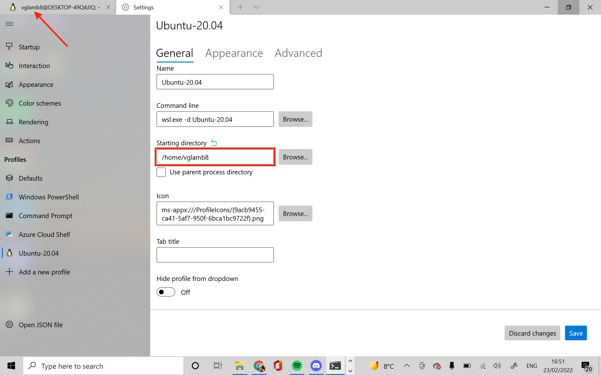

# Fix React Performance Issues

For all Windows users, we have a final solution to the performance issues experienced when initialising and editing React apps. Rather than running your commands in Windows to access files hosted in Windows, you'll be moving your course directory to the virtual filesystem, where your terminal commands will also run at native speed. 

### Watch the [video tutorial](https://youtu.be/vn7LnC8u4-Y) to apply this solution.

**Prerequisite**: Ensure your react projects are all in one central folder; ideally the folder should be named 'blackcodher'

1. Confirm npm is installed locally: `which npm` The returned path should start with */usr/bin* or possibly */home/[WSL username]/.nvm* — in any case, it shouldn't start with */mnt/c*
2. Ensure you're in your Linux home directory: `cd ~`
3. Copy files from Windows to linux: `rsync -azh --info=progress2 --exclude='node_modules' /mnt/c/[path to blackcodher folder] .` e.g. `rsync -azh --info=progress2 --exclude='node_modules' /mnt/c/Users/gary/Documents/blackcodher .`
4. Open up VS Code: Run `code .`
5. Ensure the 'Remote-WSL' extension is installed in VS Code or install it using this link: <https://marketplace.visualstudio.com/items?itemName=ms-vscode-remote.remote-wsl>

Once you've confirmed your files transferred successfully and your projects are accessible, complete the following steps:

1. Set the default directory for Terminal.
   1. Open a Terminal window and click the ⌄ symbol in the tab strip at the top, then select "Settings".
   2. In the sidebar, select "Ubuntu-20.04" under "Profiles" (you may have to scroll down in the sidebar to see the option).
   3. Delete the value in the "Starting directory" text box and enter "/home/\<Ubuntu username>". If you're not sure what your username is, you can see it in any Ubuntu tab, which will display "\<Ubuntu username>@\<computer name>" by default.

1. Delete the "blackcodher" root directory from your Windows drive.

**NOTE**: You will need to run `npm install` for all projects the first time you run them as dependencies are _not_ copied to avoid the transfer time increasing by a magnitude.

Any questions or issues, just post a reply in the thread. 

**Note:** *To access your files from the Windows File Explorer, navigate to \\\\WSL$\Ubuntu-[Ubuntu version]\home\[WSL username]: \\\\WSL$\Ubuntu-20.04\home\hael You may find it helpful to pin this directory for easy access.*
